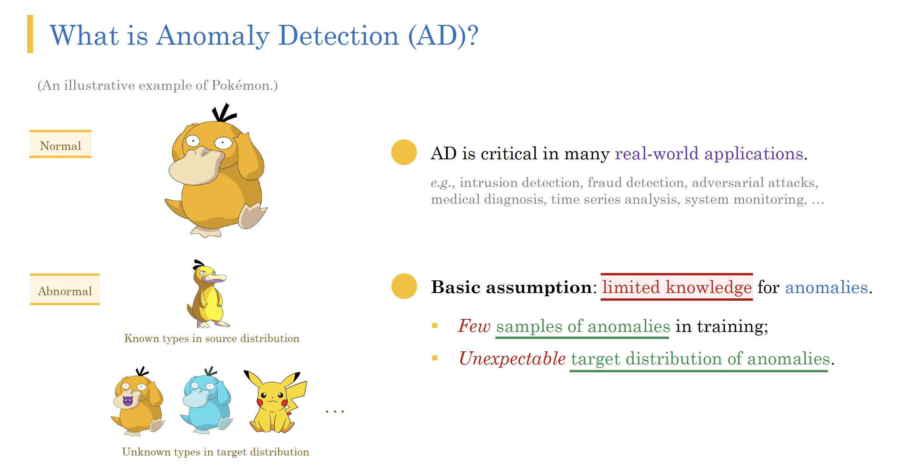

# Understanding Bias in Deep Anomaly Detection
[](https://www.python.org/downloads/release/python-380/) [](https://github.com/pytorch/pytorch/releases/tag/v1.12.0) [](https://opensource.org/licenses/Apache-2.0) [](https://github.com/ZIYU-DEEP/Bias-in-Deep-Anomaly-Detection-PyTorch)

This is the code repository for the IJCAI-21 paper "[Understanding the Effect of Bias in Deep Anomaly Detection](https://arxiv.org/abs/2105.07346)" by Ziyu Ye, Prof. Yuxin Chen, and Prof. Heather Zheng.

## 0. If you are unfamiliar with anomaly detection...
Psyduck wants to talk to you!
<p align="center"></p>

Please check our detailed presentation and paper poster at the [./slides](https://github.com/ZIYU-DEEP/Understanding-Bias-in-Deep-Anomaly-Detection-PyTorch/tree/main/slides) folder.

## 1. Introduction
Simply put, we discover the counter-intuitive fact that additional labeled data in anomaly detection can hurt training and bring disastrous bias – *knowing more does not mean doing better*!

Theoretically, we propose the *first* rigorous PAC analysis for estimating the relative scoring bias for deep anomaly detection; empirically, we provide the *first* comprehensive experiments on how a biased training anomaly set affects the detection performance on different anomaly classes.

The main takeaway message is anomaly detection practitioner must *not* blindly believe in SOTA models, and must treat additional labeled data with extra care.

Again, the big picture is: the ***access to more information*** leads to ***worse generalization*** in the presence of ***distributional shift***. If you are interested in learning more about such phenomena more broadly, i recommend you to read this one: [Causal Confusion in Imitation Learning](https://arxiv.org/abs/1905.11979), NeurIPS '19.


## 2. Requirements
```
numpy==1.22.2
pandas==1.3.4
torch==1.4.0
joblib==0.14.1
scikit-learn==0.22.2
torchvision==0.5.0
```

## 3. Code Structure
The high-level structure of the codebase follows the ICLR '20 paper "[Deep semi-supervised anomaly detection](https://openreview.net/forum?id=HkgH0TEYwH)". We thank them for the open-source work for the anomaly detection community.

- `./loader` provides various data loaders supporting datasets like [ImageNet](https://www.image-net.org/), [FashionMNIST](https://github.com/zalandoresearch/fashion-mnist), [Driver Anomaly Detection](https://www.ei.tum.de/mmk/dad/), [Retina OCT Images](https://www.kaggle.com/paultimothymooney/kermany2018), and your own customized datasets. You can check the the `main_loading.py` inside for a detailed list.
- `./network` provides several network structures to build up the model. Please see the viables options in `main_network.py`.
- `./model` contains six popular and SOTA models for anomaly detection with deep learning, ranging from Deep SVDD to Autoencoding Binary Classifier. Please check our paper for the detailed model description.
- `./main` contains the main files to verify the PAC analysis or to characterize the effect of bias.


## 4. Commands
For reimplementation our work of PAC analysis (notice: some of the import function are outdated, you may adapt it to the main.py):
```shell
cd ./main
python main_pac_gaussian_train.py --loader_name gaussian9d_hard --n 2000 --mix 1 --ratio_abnormal 0.1 --n_feature 9
```

For reimplementation our work of general anomaly detection (and identify bias):
```shell
# Run the FashionMNIST experiments
$ . scripts/fmnist.sh

# Run the satimage experiments
$ . scripts/satimage.sh
```
If you are unable to run `.sh` files for some reasons, you may directly copy and paste the arguments in those scripts to the terminal and directly using the python command to run.

The data for the real-world datasets are downloadable on UCI repository; please check our paper and `./helper/fetch_data.py` for details.


## 5. Citation
```tex
@inproceedings{ye2021understanding,
  author    = {Ziyu Ye and Yuxin Chen and Haitao Zheng},
  editor    = {Zhi-Hua Zhou},
  title     = {Understanding the Effect of Bias in Deep Anomaly Detection},
  booktitle = {Proceedings of the Thirtieth International Joint Conference on Artificial
               Intelligence, {IJCAI} 2021, Virtual Event / Montreal, Canada, 19-27
               August 2021},
  pages     = {3314--3320},
  publisher = {ijcai.org},
  year      = {2021},
  url       = {https://doi.org/10.24963/ijcai.2021/456},
}
```

## 6. Contacts
If you have any problem regarding the code or the paper, please do not hesitate to contact me at ziyuye@uchicago.edu or ziyuye@live.com.
